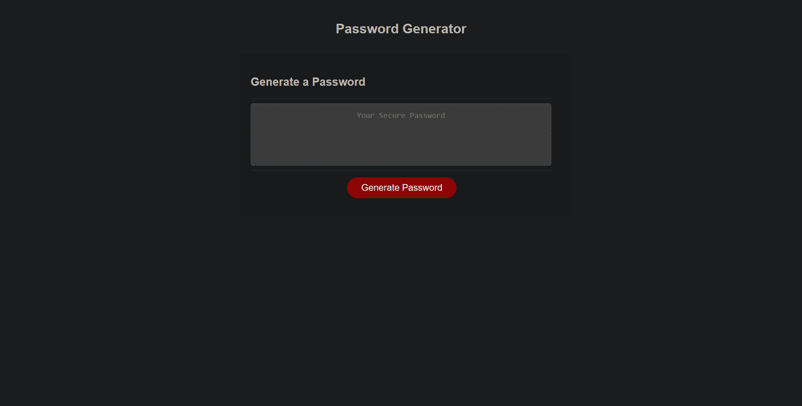

# password-generator
# Password Generator homework for UCF Bootcamp

# Maintained By:
Austin Donovan

# Description
This is a password generator created with vanilla Javascript that will concac arrays to create a randomly generated array, which is stored in an empty array, which is stored in an empty variable that is then passed into the index.html utilizing a query selector.

# Contact Information:
Email: AustinLDonovan@gmail.com

Github: https://github.com/AustinLD

# Project Location:
[Github Repository](https://github.com/AustinLD/password-generator)

[Github Live Link](https://austinld.github.io/password-generator/)

# Project Example:

